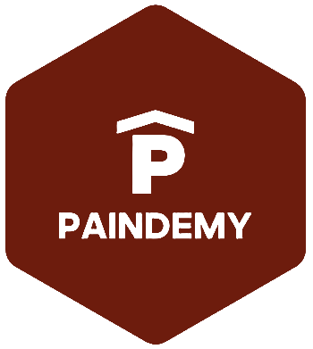

# [Paîndemy](https://paindemy.herokuapp.com/)

Le projet “Paîndemy” est fait pour tous ceux qui sont intéressés par l’apprentissage de la boulangerie et pâtisserie. Il permet également à ceux qui aiment partager et transmettre des savoirs de pouvoir le faire. Un autre objectif de ce projet est de permettre aux professionnels et débutants de calculer automatiquement les dosages pour les recettes.

## Table of Contents

- [Project Description](#project-description)
- [Installation](#installation)
- [Usage](#usage)
- [Features](#features)
- [Contributing](#contributing)
- [License](#license)

## Project Description

Provide a more detailed overview of your project. Explain what it does, why it is useful, and any other relevant information.

## Installation

Provide step-by-step instructions on how to install and set up your project. Be sure to include any dependencies or requirements needed to run the project.

### 🔧 Tools
- Node.js [(download)](https://nodejs.org/en)

## Usage

Provide examples or instructions on how to use your project. Include screenshots or code snippets if applicable.

## Features

List the key features and functionalities of your project.

## Contributing

Explain how others can contribute to your project. Include guidelines for pull requests and any specific development setup needed.

## License

Indicate the license under which your project is released. For example:

This project is licensed under the [MIT License](LICENSE).
